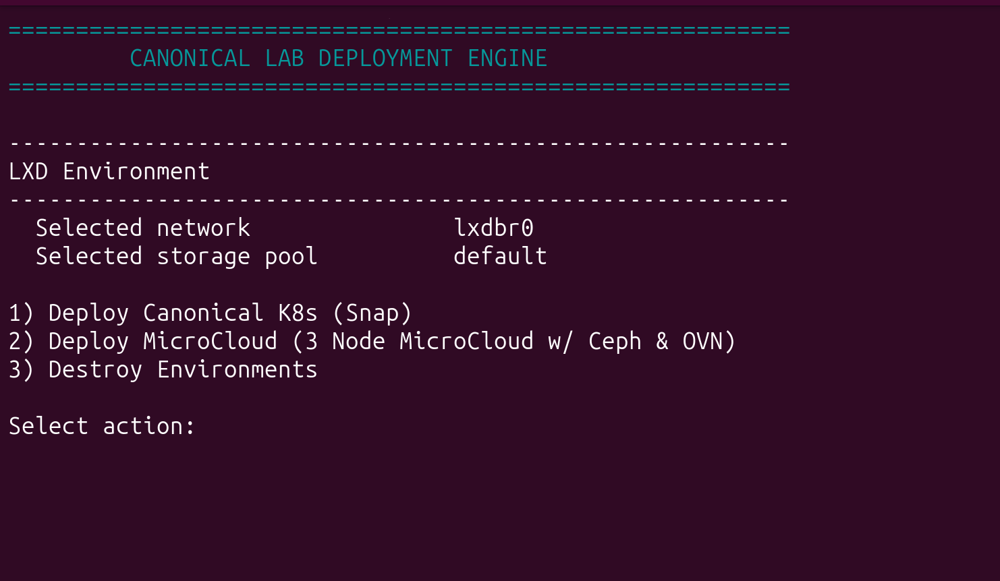

# Canonical Lab Automation

Canonical Lab Automation is a guided command-line tool for creating repeatable
Canonical infrastructure labs on a single LXD host. It provisions Ubuntu
virtual machines with OpenTofu and, for full deployments, configures the
selected product with Ansible.

The project supports:

- **MicroCloud**
- **Canonical Kubernetes (Snap)**
- **Canonical Kubernetes (Juju)**

Each product is available as either a complete, automated deployment or an
infrastructure-only training environment.

> [!IMPORTANT]
> This project is intended for labs, demonstrations, learning, and functional
> testing. It is not a production deployment or high-availability solution.
> All virtual machines run on the same LXD host.

## Contents

- [Choose a Lab Type](#choose-a-lab-type)
- [How the Automation Works](#how-the-automation-works)
- [Requirements](#requirements)
- [Install and Prepare the Host](#install-and-prepare-the-host)
- [Quick Start](#quick-start)
- [Full and Training Deployments](#full-and-training-deployments)
- [Lab Names and Isolation](#lab-names-and-isolation)
- [Sizing Profiles](#sizing-profiles)
- [Deploy MicroCloud](#deploy-microcloud)
- [Deploy Canonical Kubernetes (Snap)](#deploy-canonical-kubernetes-snap)
- [Deploy Canonical Kubernetes (Juju)](#deploy-canonical-kubernetes-juju)
- [Manage Existing Labs](#manage-existing-labs)
- [Access a Lab](#access-a-lab)
- [Safety and Operational Behavior](#safety-and-operational-behavior)
- [Troubleshooting](#troubleshooting)
- [Further Reading and Support](#further-reading-and-support)
- [Project Layout](#project-layout)

## Choose a Lab Type

Use this table if you are not sure which option to select.

| Lab | Use it when you want to | Default topology |
| --- | --- | --- |
| MicroCloud | Learn or test clustered LXD, MicroCeph, and MicroOVN | 3 nodes |
| Canonical Kubernetes (Snap) | Run Canonical Kubernetes directly from the `k8s` snap | 3 control-plane nodes and 1 worker |
| Canonical Kubernetes (Juju) | Deploy Canonical Kubernetes as Juju-managed applications | 1 Juju controller, 1 Kubernetes control-plane node, and 1 worker |
| Training variant | Receive prepared virtual machines, networking, disks, and SSH access without automated product installation | Matches the selected product |

For a first test, the recommended starting point is a **training lab**. It
validates the infrastructure and SSH access without installing or bootstrapping
the product.

## How the Automation Works

The deployment has three layers:

1. **LXD** runs the virtual machines and provides storage and networking.
2. **OpenTofu** creates and tracks the infrastructure.
3. **Ansible** installs and configures the selected product for full deployments.

The main scripts are:

- `prep_host.sh`: prepares the host and validates prerequisites.
- `orchestrate.sh`: creates, updates, rebuilds, or destroys labs.

Some terms used in this guide:

- **Host**: the physical or virtual Linux machine running LXD.
- **Node**: an LXD virtual machine that belongs to a lab.
- **NIC**: a network interface attached to a virtual machine.
- **CIDR**: an IP subnet written in a form such as `172.28.40.0/24`.
- **Control plane**: Kubernetes nodes that manage the cluster.
- **Worker**: a Kubernetes node intended to run workloads.

## Requirements

### Host requirements

You need:

- a Linux host capable of running LXD virtual machines;
- hardware virtualization support (`/dev/kvm`);
- a regular user account with `sudo` access;
- internet access for Ubuntu images, snaps, packages, Ansible content, and
  product artifacts;
- enough CPU, memory, and storage for the selected topology.

The automated preparation path uses `apt` and `snap`, so an Ubuntu host is
recommended.

There is no single hardware minimum for every scenario. Before provisioning,
the sizing advisor examines the host and proposes values for the selected
topology. MicroCloud requires at least three nodes and therefore needs more
resources than a small single-node Kubernetes lab.

> [!NOTE]
> The sizing advisor evaluates the selected lab against the host's total
> resources. On a host that already contains other labs, review the current LXD
> allocations before accepting a large sizing profile.

### Software

The project uses:

- LXD
- OpenTofu
- Ansible
- the `community.general` Ansible collection
- OpenSSH client tools

The preparation script installs or configures missing requirements.

## Install and Prepare the Host

### 1. Download the repository

The recommended method is Git:

```bash
git clone https://github.com/ismailkayi/lab-automation.git
cd lab-automation
```

To test changes that have not yet reached the default branch:

```bash
git clone --branch staging \
  https://github.com/ismailkayi/lab-automation.git \
  lab-automation-staging
cd lab-automation-staging
```

The `staging` branch can change more frequently. Use the default branch unless
you specifically need a feature that is still under validation.

If Git is not available, download the default branch as a ZIP archive:

```bash
wget \
  https://codeload.github.com/ismailkayi/lab-automation/zip/refs/heads/main \
  -O lab-automation.zip
unzip lab-automation.zip
cd lab-automation-main
```

### 2. Prepare the host

Run the preparation script as the regular user who will operate the labs:

```bash
chmod +x prep_host.sh
./prep_host.sh
```

The script can:

- install LXD, OpenTofu, Ansible, and OpenSSH client tools;
- initialize LXD when no storage pool exists;
- create a usable LXD bridge when needed;
- add the current user to the `lxd` group;
- install the required Ansible collection;
- create the lab SSH key at `~/.ssh/id_rsa_lab`;
- initialize the OpenTofu providers;
- validate LXD storage, networking, and non-root access;
- repair ownership left by an earlier run with `sudo`.

If the script adds you to the `lxd` group, activate the new membership before
continuing:

```bash
newgrp lxd
```

Alternatively, sign out and sign in again.

> [!WARNING]
> Do not run `orchestrate.sh` with `sudo`. The orchestrator deliberately stops
> when run as root so that SSH keys, OpenTofu state, and inventory files remain
> owned by the regular lab user.

### 3. Verify host access

These commands should complete without `sudo`:

```bash
lxc info
tofu version
ansible --version
```

## Quick Start

From the repository directory:

```bash
chmod +x orchestrate.sh
./orchestrate.sh
```

The main menu is grouped by purpose:

```text
FULL LAB DEPLOYMENTS
  1) MicroCloud (automated deployment)
  2) Canonical K8s - Snap (automated deployment)
  3) Canonical K8s - Juju (automated deployment)

TRAINING LABS - INFRASTRUCTURE ONLY
  4) MicroCloud Training
  5) Canonical K8s - Snap Training
  6) Canonical K8s - Juju Training

ENVIRONMENT MANAGEMENT
  7) Destroy Environments
  0) Exit
```

For a first deployment:

1. Choose a full or training scenario.
2. Choose **Deploy a new lab**.
3. Enter a short lab name, for example `demo`.
4. Select the topology and sizing profile.
5. Review the displayed configuration.
6. Wait for infrastructure provisioning and validation to finish.
7. Use the final summary to connect to the lab.

Screenshots may differ slightly as menu options evolve.



## Full and Training Deployments

| Behavior | Full deployment | Training deployment |
| --- | --- | --- |
| Creates LXD virtual machines | Yes | Yes |
| Creates networking and disks | Yes | Yes |
| Injects the lab SSH key | Yes | Yes |
| Waits for cloud-init | Yes | Yes |
| Validates node access | Yes, through the Ansible/LXD connection | Yes, through SSH to every node |
| Installs product packages | Yes | No |
| Bootstraps the product or cluster | Yes | No |

Training labs intentionally leave product installation to the participant:

- **MicroCloud Training** leaves MicroCloud, MicroCeph, MicroOVN, and LXD
  installation and cluster initialization to the participant. Each node also
  receives an extra local disk for storage exercises.
- **Canonical Kubernetes Snap Training** leaves `k8s` snap installation and
  cluster bootstrap to the participant.
- **Canonical Kubernetes Juju Training** leaves Juju installation, controller
  bootstrap, and application deployment to the participant.

Full and training labs use separate OpenTofu workspaces. The same short name
can therefore be used once for a full lab and once for a training lab.

## Lab Names and Isolation

When prompted, enter a short name containing letters and numbers:

```text
demo
```

The orchestrator converts it into a scenario-specific OpenTofu workspace:

| Selection | Workspace |
| --- | --- |
| MicroCloud | `demo_microcloud` |
| MicroCloud Training | `demo_training-microcloud` |
| Kubernetes Snap | `demo_k8s-snap` |
| Kubernetes Snap Training | `demo_training-k8s-snap` |
| Kubernetes Juju | `demo_k8s-juju` |
| Kubernetes Juju Training | `demo_training-k8s-juju` |

Workspaces keep the OpenTofu state for each lab separate. LXD resource names
use the same prefix with LXD-safe hyphens.

Do not manually delete the `terraform.tfstate.d/` directory. It contains the
state required to update and safely destroy existing labs.

## Sizing Profiles

Before a new or rebuilt lab is created, the orchestrator examines host CPU,
memory, and, where applicable, storage. It then presents practical sizing
profiles:

| Profile | Purpose |
| --- | --- |
| `balanced` | Recommended default for most labs |
| `conservative` | Lower resource use |
| `performance` | More resources and headroom |
| `custom` | Manually enter per-node values |

The selected values are shown before provisioning.

For MicroCloud, custom sizing includes:

- vCPU per node;
- memory per node in GiB;
- root disk per node in GiB;
- Ceph disk per node in GiB.

For Kubernetes, control-plane and worker nodes are sized separately.


## Deploy MicroCloud

### MicroCloud lab contents

A MicroCloud lab includes:

- 3 to 10 Ubuntu virtual machines;
- one root disk and one dedicated Ceph data disk per node;
- MicroCloud, MicroCeph, MicroOVN, and LXD in full mode;
- an additional local disk per node in training mode;
- one of the network layouts described below.

The default topology is three nodes.

### Choose a network layout

After selecting the node count, choose a network mode.

#### Standard - 2 NICs

This is the default and backward-compatible layout.

| Interface | Purpose |
| --- | --- |
| Management NIC | SSH, MicroCloud discovery, LXD management, and cluster communication |
| OVN uplink NIC | Dedicated OVN uplink; brought up at boot with no IPv4 or IPv6 address |

The Linux interface names are assigned by the guest operating system and can
look like `enp5s0` and `enp6s0`.

Choose this layout for general learning and functional testing.

#### Fully Segregated - 4 NICs

This layout separates management, OVN, and Ceph traffic.

| Interface | Purpose |
| --- | --- |
| `mgmt0` | SSH, MicroCloud discovery, and LXD management |
| `ovn-uplink` | Dedicated IP-free OVN uplink |
| `ovn-underlay` | OVN Geneve encapsulation traffic |
| `ceph-general` | Ceph public/client and internal/replication traffic |

The orchestrator proposes separate `/24` CIDRs for `ovn-underlay` and
`ceph-general`. Press **Enter** to accept the proposed values or enter your own
IPv4 CIDRs.

Before provisioning, it checks the selected CIDRs against:

- host routes;
- LXD managed subnets;
- CIDRs recorded for other managed labs;
- the other selected network plane;
- the planned OVN external subnet.

Provisioning stops if a collision is found. Static addresses are matched to
stable MAC addresses and persist across reboots.

Use this layout when you want to study or validate dedicated OVN and Ceph
network planes.

### MicroCloud validation

Before cluster bootstrap, the orchestrator validates:

- expected interfaces and addresses;
- an IP-free OVN uplink;
- the management default route;
- plane-specific routes in four-NIC mode;
- all-to-all OVN underlay and Ceph connectivity in four-NIC mode.

After bootstrap, it checks:

- MicroCloud cluster membership;
- Ceph health;
- OVN encapsulation addresses;
- Ceph public and cluster network settings.

A confirmed mismatch fails validation. If a product version does not support
an introspection command or returns an unknown output format, the deployment is
not incorrectly marked as failed. The summary reports:

```text
Deployment: SUCCESS
Validation: PASSED WITH WARNINGS
```

Review the accompanying warning and perform the suggested manual check.

### Complete a new MicroCloud deployment

1. Run `./orchestrate.sh`.
2. Select **MicroCloud** or **MicroCloud Training**.
3. Select **Deploy a new lab**.
4. Enter a lab name.
5. Choose 3 to 10 nodes.
6. Choose the two-NIC or four-NIC network layout.
7. Select a sizing profile.
8. Wait for provisioning and validation.

For a full deployment, the final summary includes cluster health, node
addresses, and web UI links on port `8443`.


### Change an existing MicroCloud lab

MicroCloud node count and network mode are creation-time choices. To change
either value:

1. select the existing lab;
2. choose **Rebuild**;
3. confirm destruction;
4. choose the new topology during redeployment.

A rebuild permanently deletes the existing lab before creating it again.

## Deploy Canonical Kubernetes (Snap)

### Snap lab contents

The Snap scenario creates:

- 1 or 3 control-plane virtual machines;
- 0 or more worker-only virtual machines;
- the Canonical Kubernetes `k8s` snap on every full-deployment node;
- a bootstrapped Kubernetes cluster.

Defaults:

- 3 control-plane nodes;
- 1 worker node.

### Complete a new Snap deployment

1. Run `./orchestrate.sh`.
2. Select **Canonical K8s - Snap** or its training option.
3. Select **Deploy a new lab**.
4. Enter a lab name.
5. Choose 1 or 3 control-plane nodes.
6. Choose the number of workers; enter `0` if none are required.
7. Select a sizing profile.
8. Wait for provisioning and validation.

For a full deployment, the final summary includes:

- the Kubernetes API endpoint;
- control-plane and worker addresses;
- node status from `kubectl get nodes -o wide`.

### Expand an existing Snap cluster

The Snap scenario supports in-place expansion:

1. select **Manage an existing lab**;
2. choose the lab;
3. choose **Add**;
4. enter target node counts greater than or equal to the current counts.

Shrinking in place is not supported. Choose **Rebuild** to reduce the number of
nodes.

## Deploy Canonical Kubernetes (Juju)

### Juju lab contents

The Juju scenario separates Juju management from the Kubernetes nodes:

- 1 dedicated Juju controller VM;
- 1 or 3 Kubernetes control-plane VMs;
- 1 or more Kubernetes worker VMs;
- a Juju manual cloud and workload model;
- Canonical Kubernetes applications deployed by Juju.

Defaults:

- 1 Juju controller;
- 1 Kubernetes control-plane node;
- 1 worker node.

The current implementation uses a single Juju controller. Because all VMs are
on one LXD host, this scenario should not be treated as production HA.

### Complete a new Juju deployment

1. Run `./orchestrate.sh`.
2. Select **Canonical K8s - Juju** or its training option.
3. Select **Deploy a new lab**.
4. Enter a lab name.
5. Choose 1 or 3 Kubernetes control-plane nodes.
6. Choose one or more worker nodes.
7. Select a sizing profile.
8. Wait for provisioning and validation.

For a full deployment, the final summary includes:

- the Juju controller name and address;
- Kubernetes control-plane and worker addresses;
- a command for retrieving the kubeconfig.

### Expand an existing Juju deployment

The Juju scenario supports in-place expansion:

1. select **Manage an existing lab**;
2. choose the lab;
3. choose **Update in place**;
4. enter target control-plane and worker counts greater than or equal to the
   current counts.

Existing node sizing is preserved, and new machines are reconciled into the
Juju model. Shrinking in place is not supported; use **Rebuild** instead.

## Manage Existing Labs

When labs already exist for the selected scenario, the orchestrator offers:

```text
1) Deploy a new lab
2) Manage an existing lab
0) Cancel
```

Available actions depend on the product:

| Product | Available actions |
| --- | --- |
| MicroCloud | Rebuild, delete, cancel |
| Kubernetes Snap | Add, rebuild, cancel |
| Kubernetes Juju | Update in place, rebuild, delete, cancel |

### Rebuild

Rebuild destroys the selected lab and creates it again. Use it to:

- reduce a topology;
- change the MicroCloud network mode;
- recover a disposable lab that cannot be reconciled safely.

All data stored in the lab is permanently deleted.

### Destroy

To permanently remove a lab:

1. run `./orchestrate.sh`;
2. select **Destroy Environments**;
3. select the workspace from the numbered list;
4. type `yes` exactly when prompted.


The orchestrator destroys tracked resources, removes safe owned MicroCloud
network remnants, deletes the OpenTofu workspace, and removes its generated
inventory file.

Lab-created MicroCloud networks include ownership tags. Cleanup removes only
networks attributed to the selected workspace; unowned or ambiguous networks
are left untouched.

## Access a Lab

### SSH

The preparation script creates one SSH key for lab access:

```text
~/.ssh/id_rsa_lab
```

Connect to any node shown in the deployment summary:

```bash
ssh -i ~/.ssh/id_rsa_lab ubuntu@<VM_IP>
```

### MicroCloud web UI

For a full MicroCloud deployment, use a URL printed in the final summary:

```text
https://<NODE_IP>:8443
```

### Kubernetes commands

For Snap deployments, commands can be run on a control-plane node:

```bash
lxc exec <control-plane-node> -- k8s kubectl get nodes
```

For Juju deployments, the final summary prints the command used to retrieve
the kubeconfig from the leader unit.

## Safety and Operational Behavior

- Run the orchestrator as the regular lab user, never with `sudo`.
- Each lab has a separate OpenTofu workspace and generated Ansible inventory.
- MicroCloud applies run serially to avoid provider races during volume
  creation.
- The LXD provider waits for asynchronous storage operations before reading
  resource state.
- Training deployments never run product installation playbooks.
- Kubernetes update paths are designed to reconcile or expand existing labs.
- In-place topology shrink is intentionally blocked.
- MicroCloud network cleanup is ownership-aware.
- Workspace deletion is verified before a destroy operation is reported as
  successful.

## Troubleshooting

### LXD works only with `sudo`

Run:

```bash
./prep_host.sh
```

If it adds your user to the `lxd` group, run:

```bash
newgrp lxd
```

or open a new login session. Confirm that `lxc info` works without `sudo`
before starting the orchestrator.

### The orchestrator says not to run as root

Exit the root shell and run:

```bash
./orchestrate.sh
```

as the regular user who prepared the host.

### A lab name already exists

Select **Manage an existing lab** instead of **Deploy a new lab**. Then choose
the update, rebuild, delete, or cancel action offered for that product.

### I need fewer Kubernetes nodes

In-place shrinking is intentionally blocked. Rebuild the lab and select the
smaller topology.

### A MicroCloud subnet collision is reported

The selected four-NIC subnet overlaps a host route, LXD network, another
managed lab, or the other network plane. Run the deployment again and enter an
unused IPv4 CIDR when prompted.

Do not bypass the check unless the networks are intentionally isolated and you
fully understand the routing design.

### A MicroCloud deployment reports validation warnings

`PASSED WITH WARNINGS` means the core deployment succeeded but a
version-specific OVN or Ceph introspection check could not be completed.
Review the warning text and run the suggested manual verification.

A confirmed address or CIDR mismatch remains a validation failure.

### A deployment stopped partway through

Do not manually create duplicate resources immediately. First inspect the
selected workspace:

```bash
tofu workspace list
tofu workspace select <workspace>
tofu state list
```

For a disposable lab, use **Destroy Environments** and deploy it again. The
destroy workflow also attempts safe cleanup of known MicroCloud remnants.

### A destroyed lab is still listed

Update to the latest repository version and run the destroy action again. An
empty workspace can be selected safely; the current workflow verifies that it
is removed before reporting success.

To inspect workspaces:

```bash
tofu workspace list
```

### SSH uses `/root/.ssh/id_rsa_lab`

The lab was previously created from a root-run orchestrator. Destroy and
recreate the affected lab as the regular user so the correct SSH key is
injected.

### Update the repository

Check the current branch:

```bash
git branch --show-current
```

Update it without rewriting history:

```bash
git pull --ff-only
```

After a provider update, initialize the locked versions:

```bash
tofu init
```

## Further Reading and Support

This repository automates several independent products. Refer to their official
documentation for product concepts and advanced administration:

- [MicroCloud documentation](https://documentation.ubuntu.com/microcloud/latest/)
- [Canonical Kubernetes documentation](https://documentation.ubuntu.com/canonical-kubernetes/latest/)
- [Juju documentation](https://documentation.ubuntu.com/juju/3.6/)
- [LXD documentation](https://documentation.ubuntu.com/lxd/latest/)
- [OpenTofu documentation](https://opentofu.org/docs/)

To report a problem with this automation, open an issue in the
[GitHub repository](https://github.com/ismailkayi/lab-automation/issues).
Include:

- the selected scenario and topology;
- the current Git commit (`git rev-parse --short HEAD`);
- the host and LXD versions;
- the complete error message;
- the output of `tofu workspace show` and `tofu state list`, when relevant.

Remove credentials, private keys, tokens, and other sensitive values before
sharing logs.

## Project Layout

| Path | Purpose |
| --- | --- |
| `prep_host.sh` | Host preparation and prerequisite validation |
| `orchestrate.sh` | Interactive deployment and lifecycle management |
| `main.tf` | LXD infrastructure definitions |
| `.terraform.lock.hcl` | Locked OpenTofu provider versions and checksums |
| `playbooks/microcloud.yml` | Full MicroCloud installation and validation |
| `playbooks/k8s_snap.yml` | Full Canonical Kubernetes Snap deployment |
| `playbooks/k8s_juju.yml` | Full Juju-managed Kubernetes deployment |
| `tests/` | Targeted regression tests |
| `docs/images/` | Documentation screenshots |
| `terraform.tfstate.d/` | Per-workspace OpenTofu state generated at runtime |
| `inventory_<workspace>.yaml` | Per-lab Ansible inventory generated at runtime |

## Next Steps

For a safe first run:

```bash
./prep_host.sh
./orchestrate.sh
```

Choose a training scenario, accept a conservative or balanced sizing profile,
and confirm SSH access to each node before creating a full deployment.
