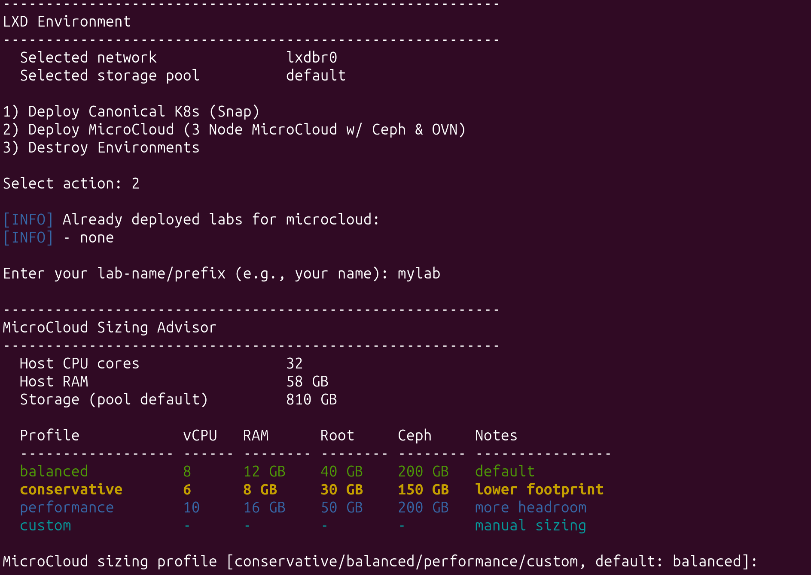
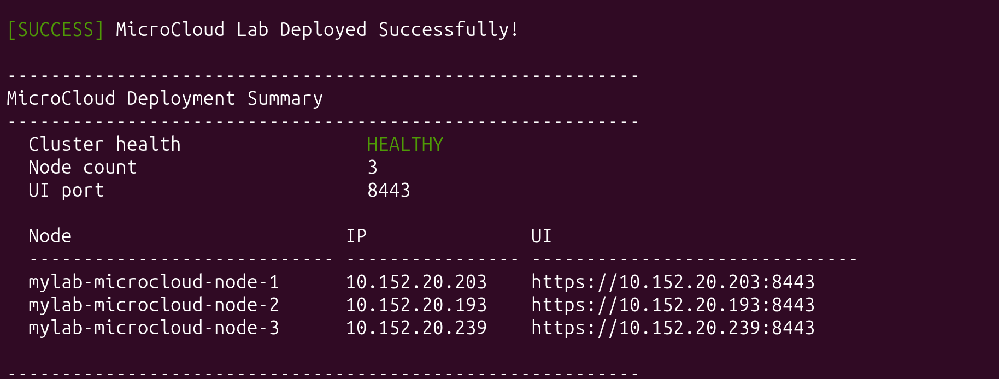
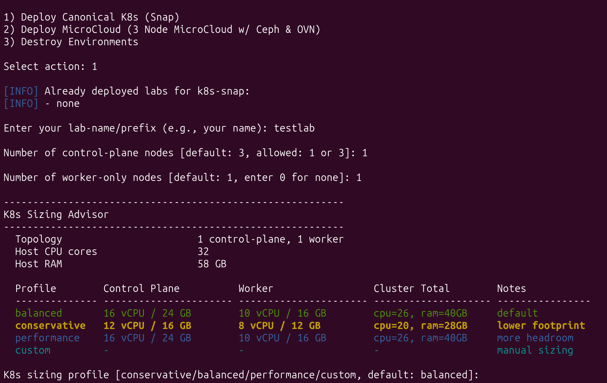
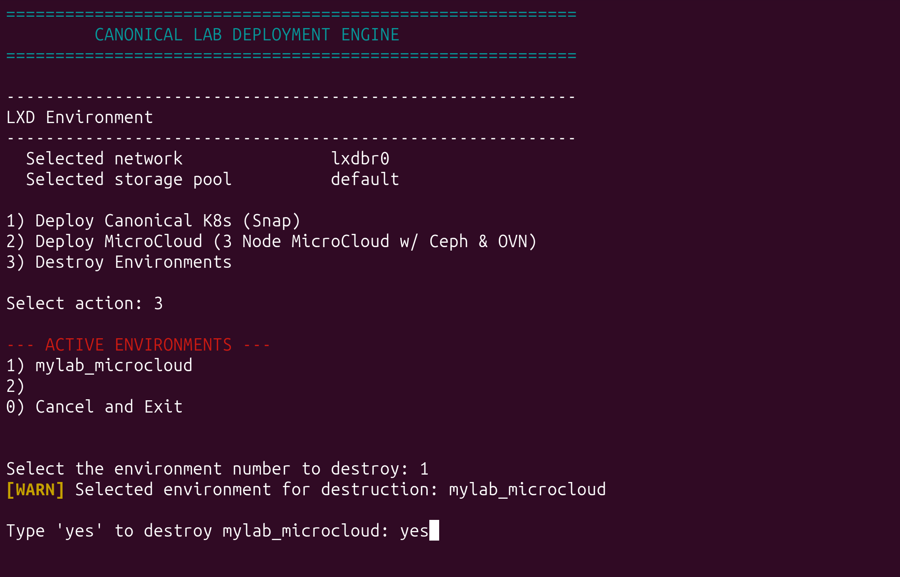

# Canonical Lab Automation

Canonical Lab Automation creates local Canonical labs on top of LXD virtual machines.

Supported scenarios:

- MicroCloud
- Canonical Kubernetes (Snap)
- Canonical Kubernetes (Juju)

## Table of Contents

- [Download](#download)
- [Before You Start](#before-you-start)
- [Quick Start](#quick-start)
- [How Naming Works](#how-naming-works)
- [Training Labs](#training-labs)
- [Deploying MicroCloud](#deploying-microcloud)
- [Deploying Canonical Kubernetes](#deploying-canonical-kubernetes)
- [Deploying Canonical Kubernetes (Juju)](#deploying-canonical-kubernetes-juju)
- [Destroying an Environment](#destroying-an-environment)
- [SSH Access](#ssh-access)
- [Typical Usage Examples](#typical-usage-examples)
- [Notes](#notes)
- [Troubleshooting](#troubleshooting)
- [Summary](#summary)

## Download

If you are not familiar with `git`, you can download this repository with `wget`:

```bash
wget https://codeload.github.com/ismailkayi/lab-automation/zip/refs/heads/main -O lab-automation.zip
unzip lab-automation.zip
cd lab-automation-main
```

After downloading, continue with the steps below.

## Before You Start

Minimum host requirements:

- a Linux host
- `sudo` access
- internet access

This project needs these tools on the host:

- LXD
- OpenTofu
- Ansible
- the `community.general` Ansible collection

You have two ways to continue:

### Option 1: Auto-prepare Script

Run:

```bash
chmod +x prep_host.sh
./prep_host.sh
```

This script checks the host and prepares missing requirements automatically. It can:

- install LXD
- run `lxd init --auto` if needed
- add your user to the `lxd` group if needed
- install OpenTofu
- install Ansible
- install the `community.general` collection
- create `~/.ssh/id_rsa_lab` if missing
- run `tofu init`
- validate LXD storage, networking, and non-root user access
- repair ownership of generated lab files left by an earlier sudo run

This is the easiest option for a new user.

Run `prep_host.sh` as the regular user who will operate the labs. The script requests sudo only for host-level changes. If it adds the user to the `lxd` group, open a new login session or run `newgrp lxd` before starting the orchestrator.

Do not run `orchestrate.sh` with sudo. It deliberately exits when run as root so SSH keys, state, and inventory files remain owned by the regular lab user.

### Option 2: Prepare the host yourself

If your host is already ready, you can skip `prep_host.sh` and run the main deployment script directly.


## Quick Start

From the repository directory:

```bash
chmod +x orchestrate.sh
./orchestrate.sh
```

You will then choose one of these grouped options:

```text
FULL LAB DEPLOYMENTS
  1) MicroCloud (automated deployment)
  2) Canonical K8s - Snap (automated deployment)
  3) Canonical K8s - Juju (automated deployment)

TRAINING LABS - INFRASTRUCTURE ONLY
  4) MicroCloud Training
  5) Canonical K8s - Snap Training
  6) Canonical K8s - Juju Training

ENVIRONMENT MANAGEMENT
  7) Destroy Environments
  0) Exit
```

## How Naming Works

You will be asked to enter a simple lab prefix such as:

```text
mylab
```

The script converts it into a workspace name automatically:

- Kubernetes: `mylab_k8s-snap`
- Kubernetes (Juju): `mylab_k8s-juju`
- MicroCloud: `mylab_microcloud`
- Kubernetes training: `mylab_training-k8s-snap`
- Kubernetes (Juju) training: `mylab_training-k8s-juju`
- MicroCloud training: `mylab_training-microcloud`

## Training Labs

Training options provision the same VM roles, sizing, networking, disks, and SSH access as their corresponding full lab. They intentionally do not run product installation or cluster bootstrap playbooks.

- MicroCloud Training leaves MicroCloud, MicroCeph, MicroOVN, and LXD installation to participants.
- Canonical K8s Snap Training leaves the Canonical K8s snap and cluster bootstrap to participants.
- Canonical K8s Juju Training leaves Juju installation, controller bootstrap, and Kubernetes deployment to participants.

After OpenTofu finishes, the script waits for cloud-init and verifies SSH access to every training VM. The final summary lists each node, its role and IP, and the participant's next step.

Full and training labs use different workspace names, so the same prefix can be used for both without sharing state. Legacy MicroCloud infra-only workspaces are still recognized as training labs.

## Deploying MicroCloud

MicroCloud has two deployment modes:

- `MicroCloud`: installs packages and performs automated cluster bootstrap
- `MicroCloud Training`: creates VM/network/disk infrastructure without installing MicroCloud packages or initializing the cluster
  - each training node gets an extra local storage disk for participant exercises, such as local ZFS tests

For a new or rebuilt MicroCloud lab, choose between `3` and `10` nodes:

- default: `3`
- minimum: `3`
- maximum enforced by this lab automation: `10`
- MicroCeph enabled
- MicroOVN enabled

The node count can be selected for full and training labs. Changing the node count or network mode of an existing MicroCloud lab requires a rebuild.

After selecting the node count, choose one of two network modes:

- `Standard - 2 NICs` (default, backward-compatible):
  - `eth0`: management, SSH, and cluster communication
  - `eth1`: dedicated IP-free MicroOVN external uplink, configured UP at boot
- `Fully Segregated - 4 NICs (Dedicated OVN and Ceph Planes)`:
  - `mgmt0`: SSH plus MicroCloud and LXD management/cluster communication
  - `ovn-uplink`: dedicated IP-free external OVN uplink
  - `ovn-underlay`: persistent static addressing for OVN Geneve encapsulation
  - `ceph-general`: persistent static addressing for both Ceph public/client and internal/replication traffic

The four-NIC mode proposes deterministic per-lab `/24` CIDRs, which can be overridden during creation or rebuild. Provisioning stops if either CIDR overlaps a host route, an LXD managed subnet, or the other selected plane. The dedicated addresses are written through cloud-init network configuration and survive reboots.

Both network modes use MAC-matched cloud-init network configuration. The OVN uplink is brought UP without DHCP, router advertisements, or IPv4/IPv6 link-local addressing, so it remains IP-free across reboots.

Before MicroCloud installation, every Standard node is checked for an UP, IP-free uplink and a management default route. Every four-NIC node is additionally checked for the expected addresses, plane-specific routes, and all-to-all OVN/Ceph connectivity. After bootstrap, the automation verifies that every OVN encapsulation address uses `ovn-underlay` and that both Ceph `public_network` and `cluster_network` use the `ceph-general` CIDR.

Training mode creates and validates the same selected NIC layout and SSH access, but still skips package installation and MicroCloud preseed/bootstrap.

Lab-created LXD networks carry ownership and role tags. Cleanup removes only networks whose ownership tag matches the selected workspace; unowned or ambiguous networks are left untouched.

### MicroCloud Sizing Profiles

During MicroCloud deployment, the script scans host resources and suggests per-node sizing for the selected node count. It stops before provisioning if the selected topology and profile exceed available CPU, RAM, or storage after host reserve.

- `balanced`: default profile
- `conservative`: smaller than balanced
- `performance`: larger than balanced
- `custom`: you enter per-node values manually

For `custom`, values are entered as per-node `vCPU`, `memory (GB)`, `root disk (GB)`, and `ceph disk (GB)`.

Sizing advisor example:



At the end of a successful deployment, the script prints:

- cluster health
- cluster nodes
- UI access links on port `8443`

Deployment status example:



### Existing MicroCloud Lab

When you select an existing MicroCloud lab, the script offers:

- `rebuild`: destroy and recreate the lab from scratch
- `delete`: remove the lab and exit
- `cancel`: stop the operation

## Deploying Canonical Kubernetes

Kubernetes supports:

- `1` or `3` control-plane nodes
- `0` or more worker-only nodes

Default values:

- `3` control-plane nodes
- `1` worker-only node

Prompts:

```text
Number of control-plane nodes [default: 3, allowed: 1 or 3]:
Number of worker-only nodes [default: 1, enter 0 for none]:
```

### Kubernetes Sizing

During Kubernetes deployment, VM sizing is calculated dynamically from host resources and selected cluster topology (`control-plane` and `worker` counts).

- Profiles: `balanced` (default), `conservative`, `performance`, `custom`
- Control-plane and worker nodes are sized separately
- CPU and memory values are rounded to practical, commonly used tiers
- `custom` lets you enter per-node vCPU and memory (GB)

Sizing advisor example:



At the end of a successful deployment, the script prints:

- cluster nodes
- Kubernetes API endpoint
- node status from `kubectl get nodes -o wide`

### Existing Kubernetes Lab

Existing labs are listed whenever you choose a deploy option. If the lab name already exists, the script shows the current topology and asks what to do:

- `add`: expand the cluster
- `rebuild`: destroy and recreate the cluster
- `cancel`: stop the operation

Important:

- growing is supported
- shrinking in place is not supported
- to reduce node count, use `rebuild`

## Deploying Canonical Kubernetes (Juju)

The Juju-based scenario creates a dedicated Juju controller VM and deploys Canonical Kubernetes on separate control-plane and worker VMs.

Canonical Kubernetes (Juju) supports:

- `1` or `3` control-plane nodes
- `1` or more worker nodes

Default values:

- `1` control-plane node
- `1` worker node

Prompts:

```text
Number of control-plane nodes [default: 1, allowed: 1 or 3]:
Number of worker nodes [default: 1, enter 1 or more]:
```

### Kubernetes (Juju) Sizing

The Juju scenario uses the same sizing advisor as the snap-based Kubernetes flow.

- Profiles: `balanced` (default), `conservative`, `performance`, `custom`
- Control-plane and worker nodes are sized separately
- `custom` lets you enter per-node vCPU and memory (GB)

At the end of a successful deployment, the script prints:

- Juju controller VM name and IP
- control-plane and worker nodes
- a kubeconfig retrieval command

### Existing Kubernetes (Juju) Lab

When you select an existing Juju lab, the script shows the current topology and offers these actions:

- `update in place`: add nodes or re-run reconciliation on the existing lab
- `rebuild`: destroy and recreate the lab from scratch
- `delete`: remove the lab and exit
- `cancel`: stop the operation

Important:

- growing is supported in place
- shrinking in place is not supported
- to reduce node count, use `rebuild`
- during in-place updates, existing node sizing is preserved
- new Juju machines are reconciled into the cluster automatically

## Destroying an Environment

Choose:

```text
7) Destroy Environments
```

Then:

1. Select the environment from the list
2. Confirm by typing `yes`

Destroy confirmation example:



## SSH Access

After deployment, connect with:

```bash
ssh -i ~/.ssh/id_rsa_lab ubuntu@<VM_IP>
```

## Typical Usage Examples

### New MicroCloud Lab

1. Run `./orchestrate.sh`
2. Choose `MicroCloud (automated deployment)`
3. Enter a lab prefix
4. Choose a node count from `3` to `10`

### New Kubernetes Lab

1. Run `./orchestrate.sh`
2. Choose `Canonical K8s - Snap (automated deployment)`
3. Enter a lab prefix such as `demo`
4. Accept defaults or choose your topology

### Expand an Existing Kubernetes Lab

1. Run `./orchestrate.sh`
2. Choose `Canonical K8s - Snap (automated deployment)`
3. Enter the same lab prefix as before
4. Choose `add`
5. Increase control-plane or worker-only count

### New Kubernetes (Juju) Lab

1. Run `./orchestrate.sh`
2. Choose `Canonical K8s - Juju (automated deployment)`
3. Enter a lab prefix such as `demo`
4. Accept defaults or choose your topology

### Expand an Existing Kubernetes (Juju) Lab

1. Run `./orchestrate.sh`
2. Choose `Canonical K8s - Juju (automated deployment)`
3. Select the existing lab
4. Choose `update in place`
5. Increase control-plane or worker count

## Notes

- Kubernetes re-runs are designed to be safe and idempotent
- Kubernetes (Juju) re-runs can reconcile newly added Juju machines into the cluster
- MicroCloud re-runs are intended for verification and reconciliation of a healthy cluster
- MicroCloud Terraform apply runs serially to reduce provider race issues during volume creation
- Training deployments never run the product installation playbooks

## Troubleshooting

### The lab already exists

Use the same lab name again.

For Kubernetes (Snap), the script will guide you through `add`, `rebuild`, or `cancel`.

For Kubernetes (Juju), the script will guide you through `update in place`, `rebuild`, `delete`, or `cancel`.

### I want fewer Kubernetes nodes than I have now

In-place shrink is intentionally blocked. Use `rebuild`.

### A MicroCloud deployment failed midway

Use the destroy workflow and deploy again.

### LXD only works with sudo

Run `./prep_host.sh` as your regular user. If it adds you to the `lxd` group, run `newgrp lxd` or open a new login session before running `./orchestrate.sh`.

### SSH points to `/root/.ssh/id_rsa_lab`

The lab was created by running the orchestrator with sudo. New runs are blocked in root context. Destroy the affected lab and recreate it as the regular user so `~/.ssh/id_rsa_lab` is injected into the VMs.

## Summary

Run `./orchestrate.sh`, choose a scenario, enter a lab name, and let the script build or manage the environment for you.
